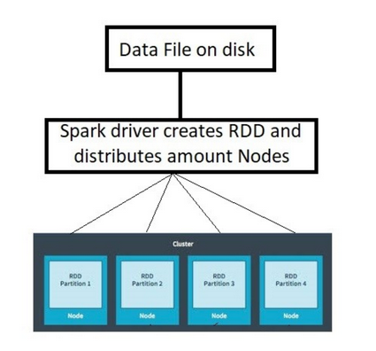
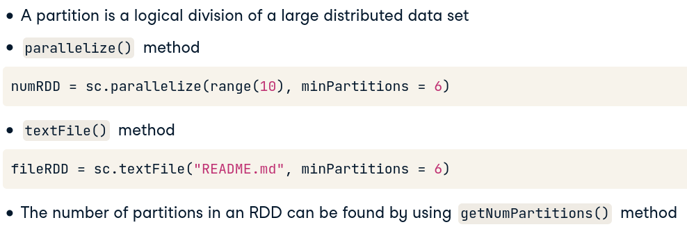
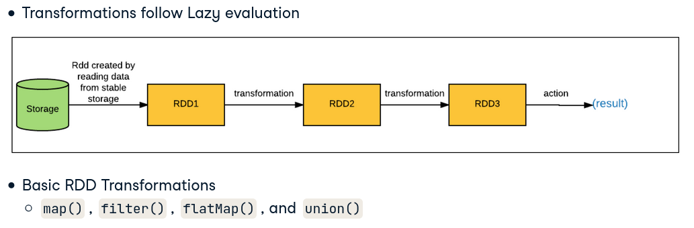
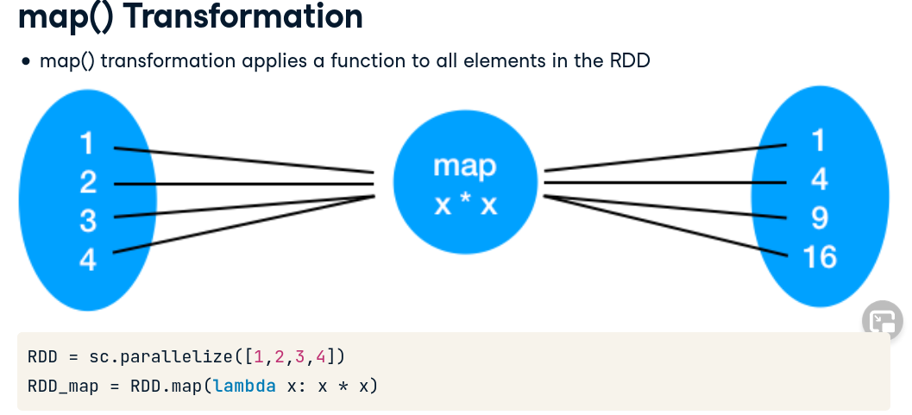
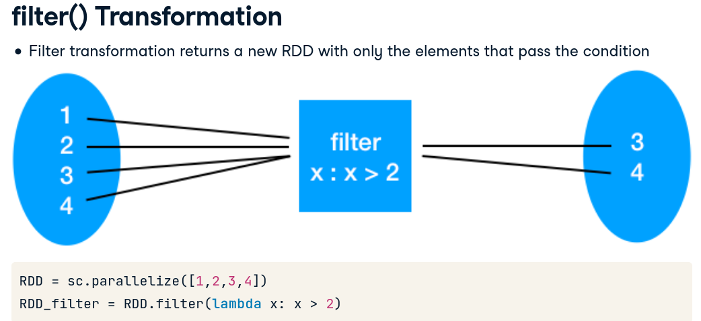
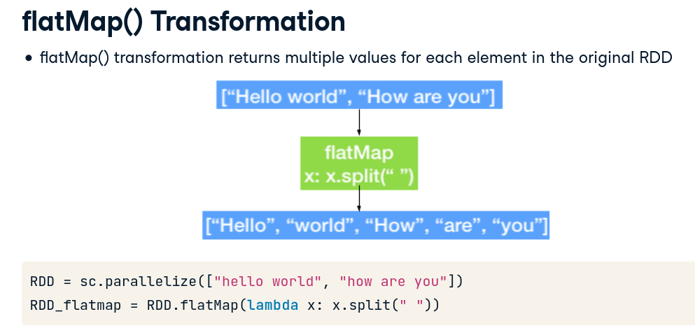
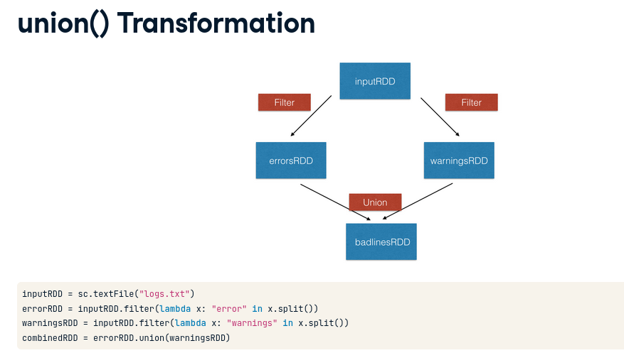

# PySpark

### A SparkContext represents the entry point to Spark functionality. It's like a key to your car. PySpark automatically creates a SparkContext for you in the PySpark shell (so you don't have to create it by yourself) and is exposed via a variable sc.

* Print the version of SparkContext : print(sc.version)
* Print the Python version of SparkContext: print(sc.pythonVer)
* Print the master of SparkContext: print(sc.master)

### Interactive Use of PySpark: Spark comes with an interactive python shell in which PySpark is already installed in it. PySpark shell is useful for basic testing and debugging and it is quite powerful. 

* Create a python list and load it into PySpark
  * numb = range(1, 100)
  * spark_data = sc.parallelize(numb) => Creates an RDD
* Load a local file into PySpark shell
  * lines = sc.textFile("/usr/local/share/datasets/README.md") => Creates an RDD
  
#### Lamda Functions (Anonymous Function)

* same as def
* quite efficient with map() and filter()
* Syntax: lambda arguments: expression 
  * double = lambda x: x*2
  * print(double(2))

#### Map Function 
##### Takes a function and a list and returns a new list which contains items returned by that function 

* Syntax: map(function,list) 
  * items = [1,2,3,4]
  * list(map(lamda x: x+2),items)
  * returns [3,4,5,6]

#### Filter Function 
##### Takes a function and a list and returns a new list for which the function evaluates as true

* Syntax: filter(function,list)
  * items = [1,2,3,4]
  * list(filter(lamda x: (x%2 !=0),items)
  * returns [1,3]
  
### RDD: Resilient Distributed Datasets

### Partitioning in PySpark

### RDD Transformations

filter_transformation.png

