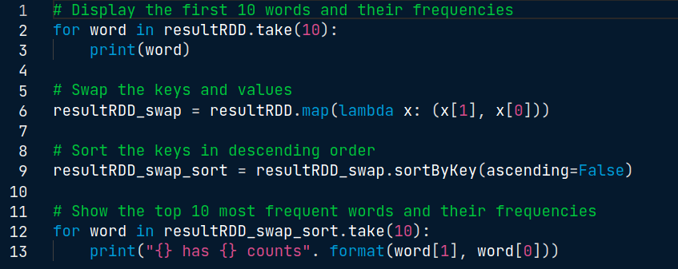

# PySpark Documentation

### A SparkContext represents the entry point to Spark functionality. PySpark automatically creates a SparkContext for you in the PySpark shell (so you don't have to create it by yourself) and is exposed via a variable sc.

* Print the version of SparkContext : print(sc.version)
* Print the Python version of SparkContext: print(sc.pythonVer)
* Print the master of SparkContext: print(sc.master)

### The key idea of spark is Resilient Distributed Datasets (RDD); it supports in-memory processing computation. This means, it stores the state of memory as an object across the jobs and the object is sharable between those jobs. Data sharing in memory is 10 to 100 times faster than network and Disk. RDD stands for Resilient Distributed Dataset, these are the elements that run and operate on multiple nodes to do parallel processing on a cluster. RDDs are immutable elements, which means once you create an RDD you cannot change it.

### Interactive Use of PySpark: Spark comes with an interactive python shell in which PySpark is already installed in it. PySpark shell is useful for basic testing and debugging and it is quite powerful. 

* Create a python list and load it into PySpark
  * numb = range(1, 100)
  * spark_data = sc.parallelize(numb) => Creates an RDD
* Load a local file into PySpark shell
  * lines = sc.textFile("/usr/local/share/datasets/README.md") => Creates an RDD
  
#### Lamda Functions (Anonymous Function)

* same as def
* quite efficient with map() and filter()
* Syntax: lambda arguments: expression 
  * double = lambda x: x*2
  * print(double(2))

#### Map Function 
##### Takes a function and a list and returns a new list which contains items returned by that function 

* Syntax: map(function,list) 
  * items = [1,2,3,4]
  * list(map(lamda x: x+2),items)
  * returns [3,4,5,6]

#### Filter Function 
##### Takes a function and a list and returns a new list for which the function evaluates as true

* Syntax: filter(function,list)
  * items = [1,2,3,4]
  * list(filter(lamda x: (x%2 !=0),items)
  * returns [1,3]
  
### RDD: Resilient Distributed Datasets

### Partitioning in PySpark

### RDD Transformations

## RDD Simple Actions
* Operation returns a value after running a computation on the RDD
* Basic Actions:
  * collect() -> returns all the elements of the dataset as an array
  * take(N) -> returns an array with the fist N elemenents of the dataset
    
  * first() -> prints the first element of the RDD
  * count() -> returns the number of elements in the RDD

## RDD Advanced Actions

# Examples
## CountingBykeys

For many datasets, it is important to count the number of keys in a key/value dataset. For example, counting the number of countries where the product was sold or to show the most popular baby names. 

## Create a base RDD and transform it

The volume of unstructured data (log lines, images, binary files) in existence is growing dramatically, and PySpark is an excellent framework for analyzing this type of data through RDDs.

## Remove stop words and reduce the dataset

## Print word frequencies

## PySpark DataFrames

* PySpark SQL is a Spark library for structured data. It provides more information about the structure of data and computation. 
* PySpark Dataframe is an immutable distributed collection of data with named columns. It is similar to a table in SQL.
* Designed for processing both structured data (relational database) and semi-structured data (JSON: JavaScript Object Notation).
* DataFrame API available in Python, R, Scala, and Java. 
* DataFrames in PySpark support both SQL queries, for example (SELECT * from table) or expression method (df.select()) 

## Spark Session 
* SparkContext is the main entry point for creating RDDs
* SparkSession provides a single point of entry to interact with Spark Dataframes
  * It is used to create Dataframe, register Dataframes, execute SQL queries
  * It is available in PySpark shell as <b>spark</b>
  
## Creating Dataframes in PySpark
* Two different methods:
  * From existind RDDs using SparkSession's createDataFrame() method
  * From various data sources (csv,JSON,txt) using SparkSession's read method
* Schema:
  * controls the data and helps Dataframes to optimize queries
  * provides information about column name, type of data in the column, empty values e.t.c.

# Recommeder Systems

# Classification

## To compute a Time Frequency Vector

# Clustering (Unsupervised ML)

